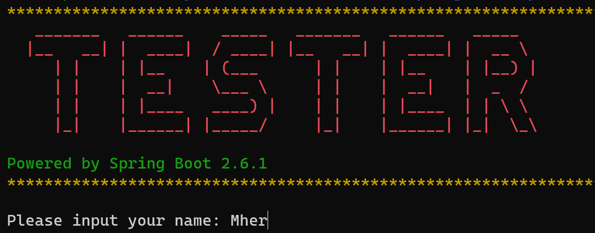

# Работы по курсу "Разработчик на Spring Framework". Otus.ru

Группа 2021-11

## Автор

Mher Arshakyan (mherarsh@gmail.com)

---

### HW01: Приложение по проведению тестирования студентов (только вывод вопросов)

**Цель:**
создать приложение с помощью Spring IoC, чтобы познакомиться с основной функциональностью IoC, на которой строится весь
Spring. Результат: простое приложение, сконфигурированное XML-контекстом.

**Описание задание:**
В ресурсах хранятся вопросы и различные ответы к ним в виде CSV файла (5 вопросов). Вопросы могут быть с выбором из
нескольких вариантов или со свободным ответом - на Ваше желание и усмотрение. Приложение должна просто вывести вопросы
теста из CSV-файла с возможными вариантами ответа.

**Требования:**

0. В приложении должна присутствовать объектная модель (отдаём предпочтение объектам и классам, а не строчкам и
   массивам/спискам строчек).
1. Все классы в приложении должны решать строго определённую задачу (см. п. 18-19 "Правила оформления кода.pdf",
   прикреплённые к материалам занятия).
2. Контекст описывается XML-файлом.
3. Все зависимости должны быть настроены в IoC контейнере.
4. Имя ресурса с вопросами (CSV-файла) необходимо захардкодить строчкой в XML-файле с контекстом.
5. CSV с вопросами читается именно как ресурс, а не как файл.
6. Scanner, PrintStream и другие стандартные типы в контекст класть не нужно!
7. Весь ввод-вывод осуществляется на английском языке.
8. Крайне желательно написать юнит-тест какого-нибудь сервиса (оцениваться будет только попытка написать тест).
9. Помним - "без фанатизма". Опционально (задание со "звёздочкой"):
    + 1*. Приложение должно корректно запускаться с помощью "java -jar"

Код, написанный в данном ДЗ будет использоваться дальше в домашних заданиях #2 (Занятие #2), #3 (Занятие #4), #4 (
Занятие #5)

### HW02: внести указанные изменения в HW01

**Требования:**

0. Переписать конфигурацию в виде Java + Annotation-based конфигурации.
1. Добавить функционал тестирования студента.
2. Добавьте файл настроек для приложения тестирования студентов.
3. В конфигурационный файл можно поместить путь до CSV-файла, количество правильных ответов для зачёта - на Ваше
   усмотрение.
4. Если Вы пишете интеграционные тесты, то не забудьте добавить аналогичный файл и для тестов.

### HW03: внести указанные изменения в HW02

**Требования:**

0. Создать проект, используя Spring Boot Initializr (https://start.spring.io)
1. Перенести приложение проведения опросов из прошлого домашнего задания.
2. Перенести все свойства в application.yml
3. Локализовать выводимые сообщения и вопросы (в CSV-файле). MesageSource должен быть из автоконфигурации Spring Boot.
4. Сделать собственный баннер для приложения.
5. Перенести тесты и использовать spring-boot-test-starter для тестирования
6. Опционально (задание со "звёздочкой"):
    + 1*. использовать ANSI-цвета для баннера.
    + 2*. если Ваш язык отличается от русского и английского - локализовать в нём.

**Описание:**

1. Запустить рограмму можно по комманде: `java -jar hw03-spring-boot-2.6.1.jar`
2. При запске можно задать язык программы следующим образом `-Dapp.lang=app-lang`, где `app-lang` язык интрефейса,
   например: для русского язык `-Dapp.lang=ru`, для английского языка `-Dapp.lang=en`. Полная комманда для запука с
   указанным языком: `java -jar -Dapp.lang=ru hw03-spring-boot-2.6.1.jar`
3. Интерфейс программы:

   

### HW04: внести указанные изменения в HW03

**Требования:**

0. Подключить Spring Shell, используя spring-starter.
1. Написать набор команд, позволяющий проводить опрос.
2. Написать Unit-тесты с помощью spring-boot-starter-test, учесть, что Spring Shell в тестах нужно отключить.

> Набор команд зависит только от Вашего желания. Вы можете сделать одну команду, запускающую Ваш Main, а можете построить полноценный интерфейс на Spring Shell.

**Описание:**

0. Доступные команды:
   + get-langs: Get available test languages.
   + set-lang: Set test language.
   + start-test: Start person testing.